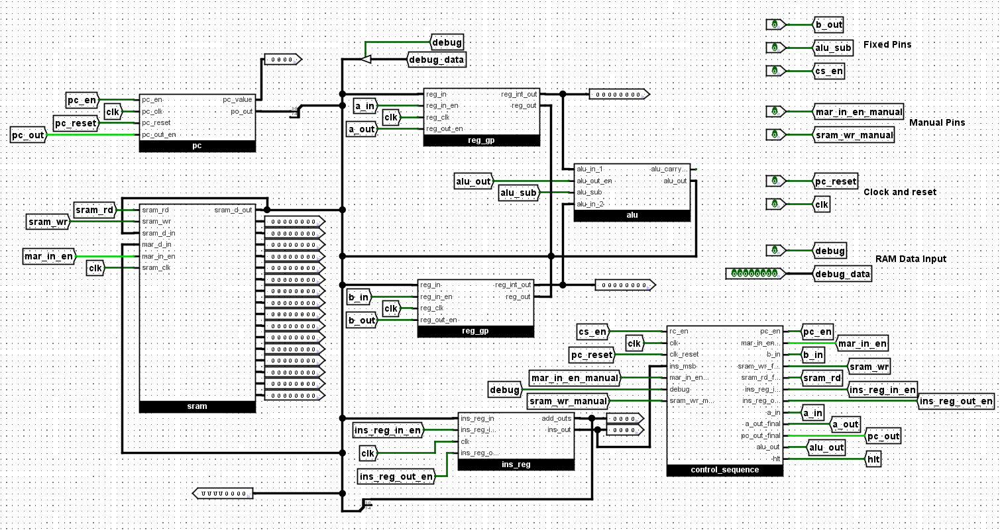
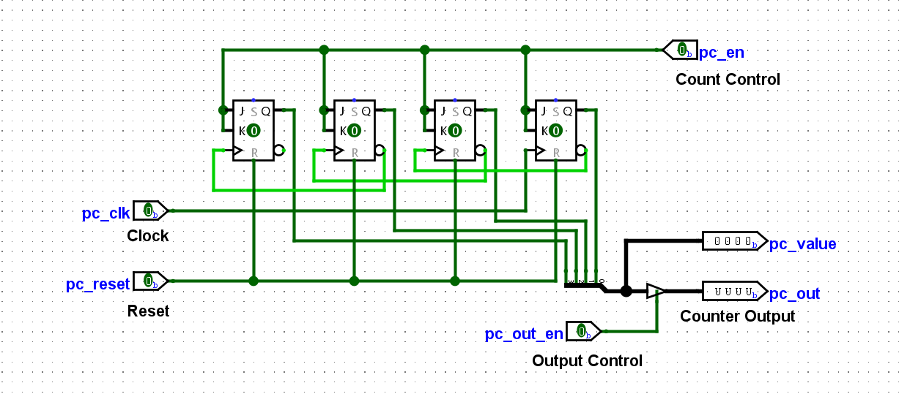
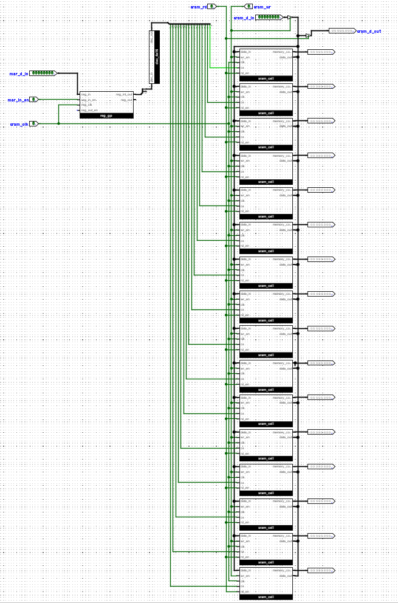
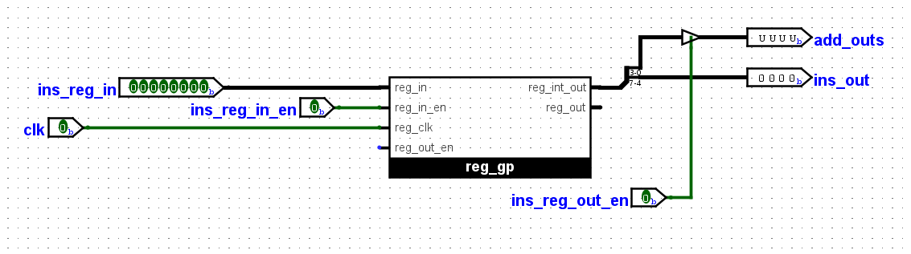
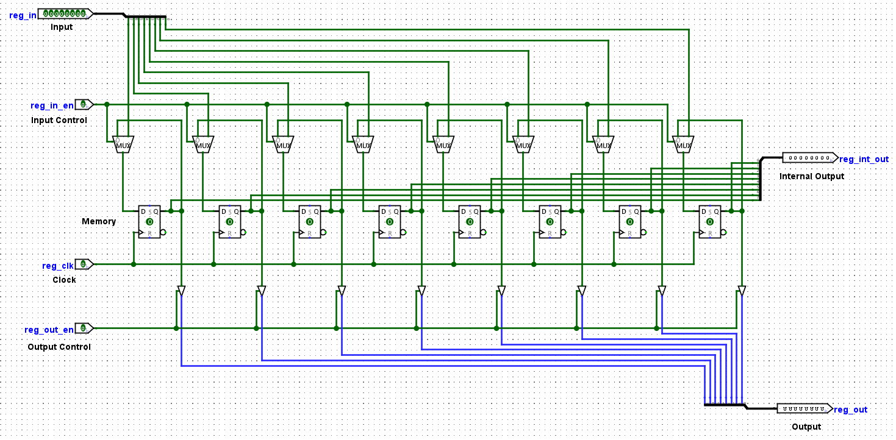
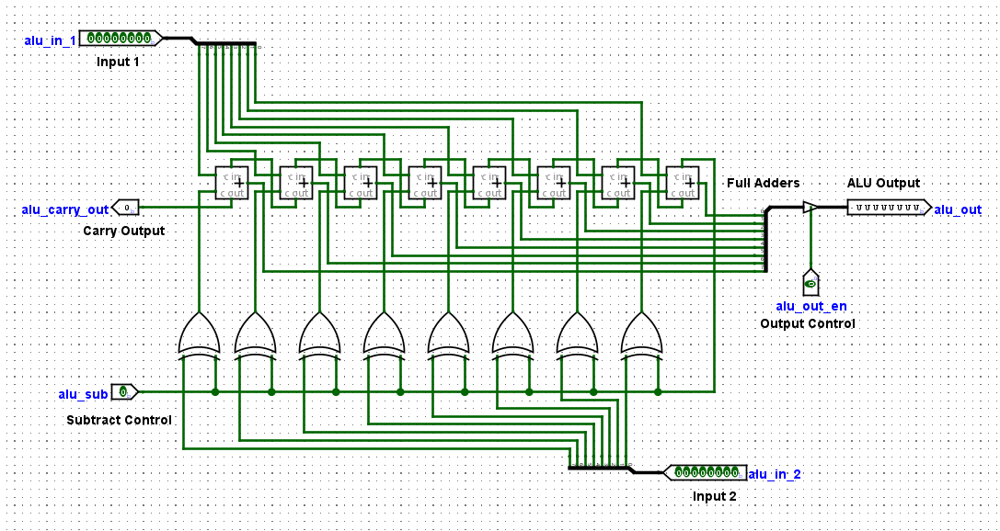
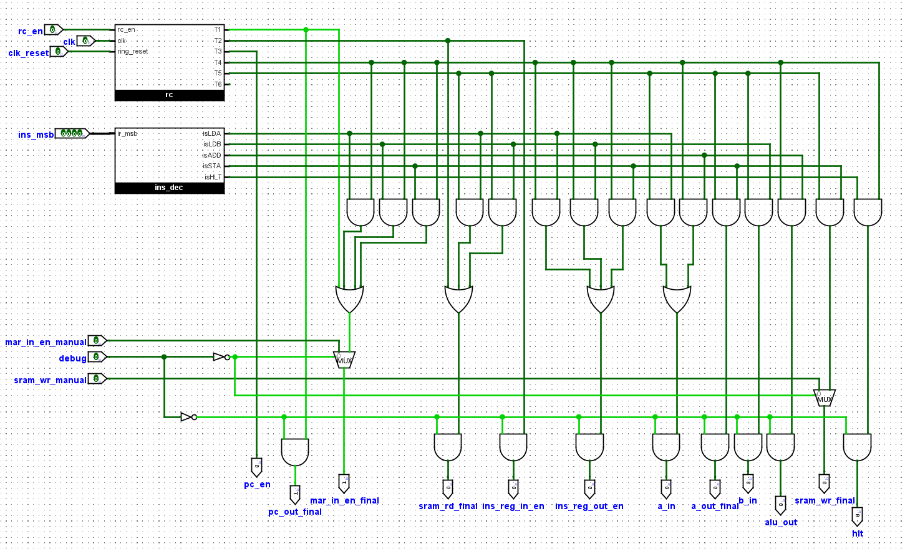

# Simple-As-Possible (SAP-1) CPU in Logisim Evolution

## Project Overview

This repository contains the **Logisim Evolution** implementation of a Simple-As-Possible (SAP-1) CPU. The SAP-1 is a foundational computer architecture used to teach the basic principles of CPU design, including the data path, control unit, and instruction set architecture.

Our implementation features a fully functional **hardwired control unit**, which automates the fetch-decode-execute cycle, allowing the CPU to run machine code programs autonomously. The project culminates in successfully executing a simple addition program, loading two pre-defined 8-bit values, adding them, and storing the sum in memory.

---

## Final Circuit

* The Final Circuit is the following circuit.

    
  

## SAP-1 Architecture Components

The SAP-1 CPU is composed of several fundamental building blocks:

* **Program Counter (PC):** A 4-bit counter that stores the memory address of the next instruction to be executed. It increments automatically after each instruction fetch.

    

* **Random Access Memory (RAM):** An 8-bit wide memory unit used to store both machine code instructions and data. Our implementation uses a 16-byte RAM.

    

* **Memory Address Register (MAR):** A 4-bit register that holds the address of the memory location currently being accessed (for reading or writing).

* **Instruction Register (IR):** An 8-bit register that temporarily holds the instruction fetched from RAM. It's split into a 4-bit opcode and a 4-bit operand (memory address).

   

* **Registers A & B (Accumulator & B-Register):** 8-bit general-purpose registers. Register A (Accumulator) is typically used for arithmetic operations and storing results. Register B holds the second operand for ALU operations.

    

* **Arithmetic Logic Unit (ALU):** An 8-bit unit capable of performing basic arithmetic (addition, subtraction) and logical operations on data from Registers A and B.

    

* **Output Register:** (Implicit in SAP-1, often just Register A or a direct output).

* **Control Unit:** The "brain" of the CPU. It generates the necessary control signals (pin activations) at the correct time to sequence the micro-operations for fetching, decoding, and executing instructions. This project focuses heavily on its hardwired implementation.

    

---

## The Hardwired Control Unit

The control unit is implemented using combinational logic (AND, OR, NOT gates) and a state counter (often called a ring counter in SAP-1 context). It orchestrates the entire CPU operation.

### Sub-Components of the Control Unit:

* **State Counter (RC):** A 3-bit counter that cycles through T-states (T1, T2, T3, T4, T5, T6). Each T-state represents a distinct phase within an instruction cycle.

    

* **Opcode Decoder:** A 4-to-16 decoder connected to the most significant 4 bits (opcode) of the Instruction Register. It generates a unique HIGH signal for each recognized instruction (e.g., `isLDA`, `isADD`, `isHLT`).

* **Control Matrix (Logic Gates):** This is the network of AND and OR gates that takes the T-state signals from the State Counter and the instruction signals from the Opcode Decoder as inputs. Its outputs are the various control pins that govern data flow and operations across the CPU.

    

### Boolean Logic for Control Pins

The following Boolean equations define when each control pin is activated (goes HIGH). These are implemented directly using AND and OR gates in the Control Matrix. `cpu_mode` is `NOT(debug)`, ensuring automated operation only when `debug` is OFF.

pc_out_final = T1 AND cpu_mode

mar_in_en_final = (T1 AND cpu_mode) OR ((T4 AND isLDA) AND cpu_mode) OR ((T4 AND isLDB) AND cpu_mode) OR ((T4 AND isSTA) AND cpu_mode) OR (mar_in_en_manual AND debug)

sram_rd_final = (T2 AND cpu_mode) OR ((T5 AND isLDA) AND cpu_mode) OR ((T5 AND isLDB) AND cpu_mode)

ins_reg_in_en_final = T2 AND cpu_mode

pc_en_final = T3 AND cpu_mode

ins_reg_out_en_final = ((T4 AND isLDA) AND cpu_mode) OR ((T4 AND isLDB) AND cpu_mode) OR ((T4 AND isSTA) AND cpu_mode)

a_in_final = ((T5 AND isLDA) AND cpu_mode) OR ((T4 AND isADD) AND cpu_mode)

a_out_final = ((T4 AND isADD) AND cpu_mode) OR ((T5 AND isSTA) AND cpu_mode)

b_in_final = (T5 AND isLDB) AND cpu_mode

b_out_final = (T4 AND isADD) AND cpu_mode

alu_out_final = (T4 AND isADD) AND cpu_mode

alu_sub = 0 (Always LOW for addition)

sram_wr_final = ((T5 AND isSTA) AND cpu_mode) OR (sram_wr_manual AND debug)

halt_condition = T4 AND isHLT (Used to stop the clock/reset the state counter)

**Note on Debug Mode:** When the `debug` pin is HIGH, `cpu_mode` becomes LOW, disabling all `_auto` signals. The `mar_in_en_final` and `sram_wr_final` pins are then controlled by their respective `_manual` inputs, allowing direct RAM programming. All other bus outputs (from SRAM, Reg A, Reg B, ALU) are also disabled when `debug` is HIGH to prevent bus conflicts.

---

## Machine Code Program: Addition Operation

This program loads two 8-bit values (51 and 25), adds them, and stores the sum (76) in memory.

* **Your ID-derived value:** Last 5 digits of 2008051 are 08051. For 8-bit, we use **51** (Decimal) = `00110011` (Binary).
* **Current Year-derived value:** Current year 2025. For 8-bit, we use **25** (Decimal) = `00011001` (Binary).

### Memory Addresses:
* Value 1 (51) at: `00001101` (Decimal 13)
* Value 2 (25) at: `00001110` (Decimal 14)
* Sum stored at: `00001111` (Decimal 15)

### Instruction Set & Program:
| Address (Binary) | Instruction (Binary) | Mnemonic & Explanation |
|------------------|----------------------|-----------------------------------------------------------|
| `00000000`       | `0001 1101`          | `LDA 13` (Load Register A with value from memory address 13) |
| `00000001`       | `0010 1110`          | `LDB 14` (Load Register B with value from memory address 14) |
| `00000010`       | `0011 0000`          | `ADD` (Add B to A, store in A. Operand bits are unused) |
| `00000011`       | `0101 1111`          | `STA 15` (Store content of Register A to memory address 15) |
| `00000100`       | `1111 0000`          | `HLT` (Halt program execution. Operand bits are unused) |

### Data Values in RAM:
| Address (Binary) | Data (Binary) | Decimal |
|------------------|---------------|---------|
| `00001101`       | `00110011`    | 51      |
| `00001110`       | `00011001`    | 25      |

---

## How It Works: The Fetch-Decode-Execute Cycle

The CPU operates in a continuous cycle, driven by the clock:

### Fetch:
* **T1:** The Program Counter (PC) places its address onto the address bus. This address is loaded into the Memory Address Register (MAR).
* **T2:** The RAM reads the instruction at the address in MAR and places it onto the data bus. The Instruction Register (IR) loads this instruction.
* **T3:** The PC increments, preparing for the next instruction.

### Decode:
The Instruction Register's opcode portion is sent to the Opcode Decoder, which activates a specific instruction line (e.g., `isLDA`). This decoded instruction, along with the current T-state from the State Counter, determines which control signals will be activated in the Execute phase.

### Execute:
The control unit activates the necessary control pins to perform the micro-operations defined by the instruction. The number of T-states in this phase varies per instruction (e.g., `LDA` takes 2 T-states, `ADD` takes 2 T-states, `HLT` takes 1 T-state).

This cycle repeats automatically for each instruction until a `HLT` instruction is encountered, which stops the clock.

---

## How to Run/Simulate the SAP-1 CPU in Logisim

Follow these steps to load your circuit, program the RAM, and run the automated simulation:

1.  **Download and Open Logisim Evolution:** If you don't have it, download [Logisim Evolution](https://github.com/logisim-evolution/logisim-evolution).
2.  **Load the Circuit:** Open the `.circ` file containing your SAP-1 CPU design in Logisim.

    

3.  **Initial Setup:**
    * Ensure the **`debug`** pin is OFF (LOW). This enables the automated control.
    * Pulse the **`pc_reset`** pin once to reset the Program Counter to `0000`.
    * Ensure the main **`clk`** (clock) component is OFF. For step-by-step testing, you'll use a manual button for the clock.

4.  **Program the RAM (Debug Mode):**
    * Turn **ON** the **`debug`** pin (HIGH). This enables manual control for RAM programming and disables automatic bus drivers.
    * For each instruction and data value (refer to the "Machine Code Program" table above):
        * **Set Address:** Use the `debug_data` input to set the 8-bit memory address (e.g., `00000000` for the first instruction).
        * **Load Address to MAR:** Pulse the `mar_in_en_manual` button once.
        * **Set Data/Instruction:** Use the `debug_data` input to set the 8-bit instruction or data value (e.g., `00011101` for `LDA 13`).
        * **Write to RAM:** Pulse the `sram_wr_manual` button once.

    

    * After loading all instructions and data, turn **OFF** the `debug` pin (LOW).
    * Pulse `pc_reset` again to ensure the PC is at `0000` for program start.

5.  **Run the Automated Program:**
    * Use the main **`clk`** button (or enable the continuous clock):
        * **Manual Stepping (Recommended for observation):** Repeatedly click the `clk` button. For each click, observe the changes in the PC, MAR, IR, Registers A and B, and the RAM contents. Follow the Fetch-Decode-Execute cycle for each instruction as detailed in the "How It Works" section.
        * **Continuous Run:** If you have a continuous clock source, enable it to watch the CPU run at speed.

    
    

6.  **Observe the `HLT` instruction:** When the CPU reaches the `HLT` instruction, the clock should stop, or the state counter should halt, indicating the program has finished.

7.  **Verify Result:** Check the content of RAM address `00001111` (decimal 15). It should contain `01001000` (decimal 76).

    

---

## Screenshots

Please add the following screenshots to your repository:

* `main_circuit.png` (Your top-level SAP-1 circuit)
* `pc_component.png` (Screenshot of your Program Counter subcircuit)
* `ram_component.png` (Screenshot of your RAM component, if custom)
* `register_a_b_components.png` (Screenshot of your Register A and B subcircuits)
* `alu_component.png` (Screenshot of your ALU subcircuit)
* `state_counter_rc.png` (Screenshot of your State Counter/Ring Counter subcircuit)
* `control_unit_logic.png` (Screenshot of your Control Unit's logic gates)
* `logisim_open_circuit.png` (Screenshot of Logisim with your circuit open)
* `ram_programming_debug_mode.png` (Screenshot showing debug mode active during RAM programming)
* `execution_example_t1.png` (Screenshot during T1 of an instruction fetch)
* `execution_example_alu.png` (Screenshot during ALU operation)
* `final_result_ram.png` (Screenshot showing the final result in RAM)

---

## Future Enhancements (Optional)

* **Expand Instruction Set:** Add more instructions like `SUB`, `OUT`, `JMP`, `JZ`, etc.
* **Microprogrammed Control:** Replace the hardwired control unit with a microprogrammed one using a ROM for greater flexibility.
* **Input/Output:** Implement a simple input device (e.g., keyboard) and output display.
