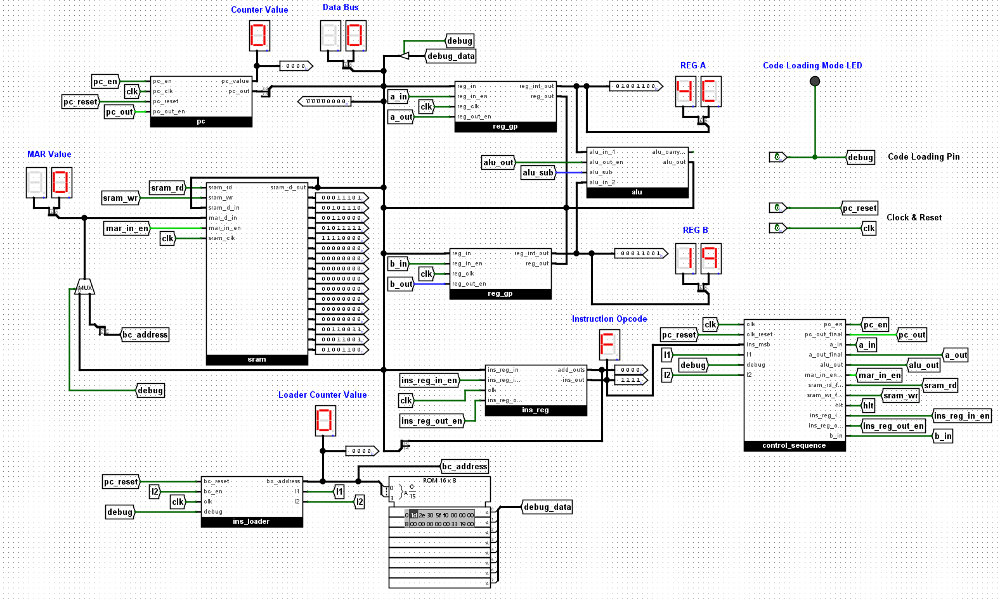
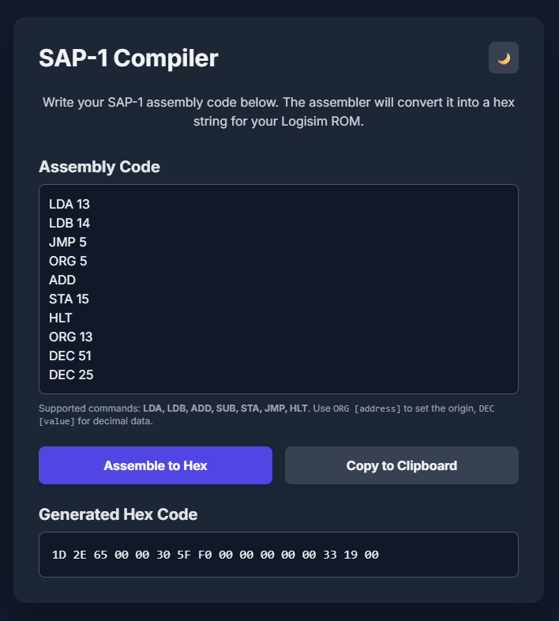
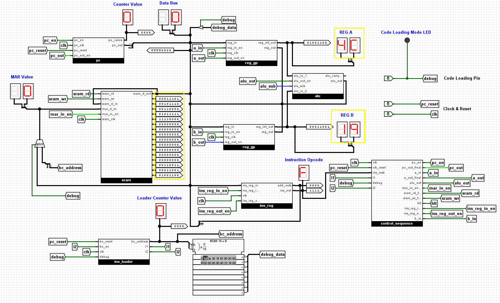
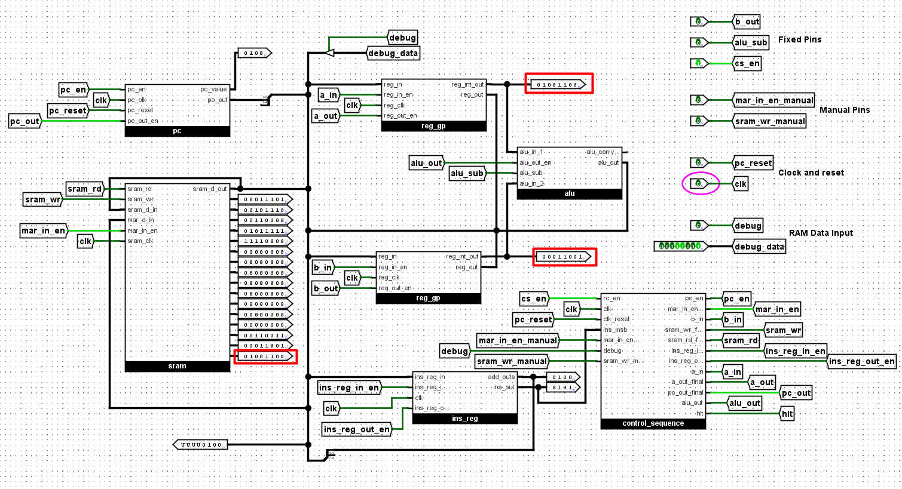

# SAP-1 CPU (Simple-As-Possible) — Logisim Evolution

## Table of Contents
Click on the `Table of Contents` below to directly go the contents
- [Project Overview](#overview)
- [Video Tutorials](#video-tutorials)
- [Final Circuits](#final-circuits)
- [Architecture Components](#architecture-components)
- [Control Unit (Hardwired)](#control-unit)
- [Instruction Set & Example](#example-program)
- [Assembler or Compiler](#compiler)
- [Fetch–Decode–Execute Cycle](#fde)
- [Run the CPU — Auto Mode](#run-auto)
- [Run the CPU — Manual Mode](#run-manual)
- [Future Improvements](#roadmap)

---

## Project Overview

This repository contains the Logisim Evolution implementation of a Simple-As-Possible (SAP-1) CPU. The SAP-1 is a foundational computer architecture used to teach the basic principles of CPU design.

This enhanced implementation features a fully functional hardwired control unit, which automates the fetch-decode-execute cycle. A key improvement is the addition of a ROM-based bootloader. This new feature allows machine code programs to be loaded into the CPU's RAM automatically, eliminating the tedious and error-prone process of manual data entry. The project culminates in successfully executing a simple addition program, loading two pre-defined 8-bit values, adding them, and storing the sum in memory.

---

## Video Tutorials

I made videos explaining the SAP-1 CPU and how to simulate it.

- Auto Code Loading (`khalid_sap1_auto.circ`): https://youtu.be/vwInhCTQctg  
- Manual Code Loading (`khalid_sap1_manual.circ`): https://youtu.be/PrJcHA_dC8Q

---

## Final Circuits

- **Auto Code Loading (`khalid_sap1_auto.circ`)**
  
  

- **Manual Code Loading (`khalid_sap1_manual.circ`)**
   
  

---

## Architecture Components

The SAP-1 CPU is composed of several fundamental building blocks:

- **Program Counter (PC):** A 4-bit counter that stores the memory address of the next instruction to be executed. It increments automatically after each instruction fetch.
  
  

- **Random Access Memory (RAM):** An 8-bit wide memory unit used to store both machine code instructions and data. This implementation uses a 16-byte RAM.
   
  

- **Memory Address Register (MAR):** A 4-bit register that holds the address of the memory location currently being accessed (for reading or writing).

- **Instruction Register (IR):** An 8-bit register that temporarily holds the instruction fetched from RAM. It's split into a 4-bit opcode and a 4-bit operand (memory address).
    
  

- **Registers A & B (Accumulator & B-Register):** 8-bit general-purpose registers. Register A (Accumulator) is typically used for arithmetic operations and storing results. Register B holds the second operand for ALU operations.
  
  

- **Arithmetic Logic Unit (ALU):** An 8-bit unit capable of performing basic arithmetic (addition, subtraction) and logical operations on data from Registers A and B.
  
  

- **Instruction Loader:** Loads code instructions from ROM to RAM with clock pulses.
  
  

- **Output Register:** (Implicit in SAP-1, often just Register A or a direct output).

- **Control Unit:** The "brain" of the CPU. It generates the necessary control signals (pin activations) at the correct time to sequence the micro-operations for fetching, decoding, and executing instructions.

  - **Control Unit — Auto Mode (overview)**
    
    
  
  - **Control Unit — Auto Mode (detail)**
    
    

---

## Control Unit (Hardwired)

The control unit is implemented using combinational logic (AND, OR, NOT gates) and a state counter (often called a ring counter in SAP-1 context). It orchestrates the entire CPU operation.

### Subcomponents

- **State Counter (RC):** A 3-bit counter that cycles through T-states (T1, T2, T3, T4, T5, T6).
  
  

- **Opcode Decoder:** A 4-to-16 decoder connected to the most significant 4 bits (opcode) of the Instruction Register. It generates a unique HIGH signal for each recognized instruction (e.g., `isLDA`, `isADD`, `isHLT`).
  
  

- **Control Matrix (Logic Gates):** The network of AND and OR gates that takes the T-state signals from the State Counter and the instruction signals from the Opcode Decoder as inputs. Its outputs are the various control pins that govern data flow and operations across the CPU.

### Control Signals — Auto Mode (`khalid_sap1_auto.circ`)

The following Boolean equations define when each control pin is activated (goes HIGH). These are implemented directly using AND and OR gates in the Control Matrix. `cpu_mode` is `NOT(debug)`, ensuring automated operation only when `debug` is OFF.

- `pc_out_final = T1 AND cpu_mode AND (NOT l2)`
- `mar_in_en_final = (T1 AND cpu_mode) OR ((T4 AND isLDA) AND cpu_mode) OR ((T4 AND isLDB) AND cpu_mode) OR ((T4 AND isSTA) AND cpu_mode) OR (l2 AND debug)`
- `sram_rd_final = (T2 AND cpu_mode) OR ((T5 AND isLDA) AND cpu_mode) OR ((T5 AND isLDB) AND cpu_mode AND (NOT l2))`
- `ins_reg_in_en_final = T2 AND cpu_mode AND (NOT l2)`
- `pc_en_final = T3 AND cpu_mode AND (NOT l2)`
- `ins_reg_out_en_final = ((T4 AND isLDA) AND cpu_mode) OR ((T4 AND isLDB) AND cpu_mode) OR ((T4 AND isSTA) AND cpu_mode AND (NOT l2))`
- `a_in_final = ((T5 AND isLDA) AND cpu_mode) OR ((T4 AND isADD) AND cpu_mode AND (NOT l2))`
- `a_out_final = ((T4 AND isADD) AND cpu_mode) OR ((T5 AND isSTA) AND cpu_mode AND (NOT l2))`
- `b_in_final = (T5 AND isLDB) AND cpu_mode AND (NOT l2)`
- `b_out_final = (T4 AND isADD) AND cpu_mode AND (NOT l2)`
- `alu_out_final = (T4 AND isADD) AND cpu_mode AND (NOT l2)`
- `sram_wr_final = ((T5 AND isSTA) AND (NOT l2)) OR (l2 AND debug)`
- `hlt = T4 AND isHLT AND (NOT l2)` *(Used to stop the clock/reset the state counter)*

### Control Signals — Manual Mode (`khalid_sap1_manual.circ`)

- `pc_out_final = T1 AND cpu_mode`
- `mar_in_en_final = (T1 AND cpu_mode) OR ((T4 AND isLDA) AND cpu_mode) OR ((T4 AND isLDB) AND cpu_mode) OR ((T4 AND isSTA) AND cpu_mode) OR (mar_in_en_manual AND debug)`
- `sram_rd_final = (T2 AND cpu_mode) OR ((T5 AND isLDA) AND cpu_mode) OR ((T5 AND isLDB) AND cpu_mode)`
- `ins_reg_in_en_final = T2 AND cpu_mode`
- `pc_en_final = T3 AND cpu_mode`
- `ins_reg_out_en_final = ((T4 AND isLDA) AND cpu_mode) OR ((T4 AND isLDB) AND cpu_mode) OR ((T4 AND isSTA) AND cpu_mode)`
- `a_in_final = ((T5 AND isLDA) AND cpu_mode) OR ((T4 AND isADD) AND cpu_mode)`
- `a_out_final = ((T4 AND isADD) AND cpu_mode) OR ((T5 AND isSTA) AND cpu_mode)`
- `b_in_final = (T5 AND isLDB) AND cpu_mode`
- `b_out_final = (T4 AND isADD) AND cpu_mode`
- `alu_out_final = (T4 AND isADD) AND cpu_mode`
- `alu_sub = 0` *(Always LOW for addition)*
- `cs_en = 1` *(Always HIGH)*
- `sram_wr_final = ((T5 AND isSTA) AND cpu_mode) OR (sram_wr_manual AND debug)`
- `hlt = T4 AND isHLT` *(Used to stop the clock/reset the state counter)*

**Note on Debug Mode:** When the `debug` pin is HIGH, `cpu_mode` becomes LOW, disabling all `_auto` signals. The `mar_in_en_final` and `sram_wr_final` pins are then controlled by their respective `_manual` inputs, allowing direct RAM programming. All other bus outputs (from SRAM, Reg A, Reg B, ALU) are also disabled when `debug` is HIGH to prevent bus conflicts.

---

## Machine Code Program: Addition

This program loads two 8-bit values (let's say 51 and 25), adds them, and stores the sum (76) in memory.

### Memory Addresses
- Value 1 (Dec 51 & Hex `33`) at: `00001101` (Decimal 13)  
- Value 2 (Dec 25 & Hex `19`) at: `00001110` (Decimal 14)  
- Sum (Dec 76 & Hex `4C`) stored at: `00001111` (Decimal 15)

### Instruction Set & Program
| Address (Binary) | Instruction (Binary) | Hex | Mnemonic & Explanation |
|------------------|----------------------|-----|-------------------------|
| `00000000` | `0001 1101` | `1D` | `LDA 13` (Load Register A with value from memory address 13) |
| `00000001` | `0010 1110` | `2E` | `LDB 14` (Load Register B with value from memory address 14) |
| `00000010` | `0011 0000` | `30` | `ADD` (Add B to A, store in A. Operand bits are unused) |
| `00000010` | `0100 0000` | `40` | `SUB` (Sub A to B, store in A. Operand bits are unused) |
| `00000011` | `0101 1111` | `5F` | `STA 15` (Store content of Register A to memory address 15) |
| `00000100` | `1111 0000` | `F0` | `HLT` (Halt program execution. Operand bits are unused) |

### Data Values in RAM
| Address (Binary) | Data (Binary) | Decimal | Hex |
|------------------|---------------|---------|-----|
| `00001101` | `00110011` | 51 | `33` |
| `00001110` | `00011001` | 25 | `19` |

### Full HEX Code
For ADD: **`1D 2E 30 5F F0 00 00 00 00 00 00 00 00 33 19 00`**

For SUB: **`1D 2E 40 5F F0 00 00 00 00 00 00 00 00 33 19 00`**

---

## Assembler or Compiler

Go to the link and write your SAP-1 assembly code and The assembler will convert it into a hex string for your Logisim ROM.

**Compiler Link:** [sap1-compiler.vercel.app](https://sap1-compiler.vercel.app)

---

## How It Works: Fetch–Decode–Execute Cycle

The CPU operates in a continuous cycle, driven by the clock:

### Fetch
- **T1:** The Program Counter (PC) places its address onto the address bus. This address is loaded into the Memory Address Register (MAR).
- **T2:** The RAM reads the instruction at the address in MAR and places it onto the data bus. The Instruction Register (IR) loads this instruction.
- **T3:** The PC increments, preparing for the next instruction.

### Decode
The Instruction Register's opcode portion is sent to the Opcode Decoder, which activates a specific instruction line (e.g., `isLDA`). This decoded instruction, along with the current T-state from the State Counter, determines which control signals will be activated in the Execute phase.

### Execute
The control unit activates the necessary control pins to perform the micro-operations defined by the instruction. The number of T-states in this phase varies per instruction (e.g., `LDA` takes 2 T-states, `ADD` takes 2 T-states, `HLT` takes 1 T-state).

This cycle repeats automatically for each instruction until a `HLT` instruction is encountered, which stops the clock.

---

## Run the CPU — Auto Mode (`khalid_sap1_auto.circ`)

Follow these steps to load your ROM-based program and run the automated simulation:

**Download and Open Logisim Evolution:** If you don't have it, download [Logisim Evolution](https://github.com/logisim-evolution/logisim-evolution).

### 1) Initial Setup
1. Open the `khalid_sap1_auto.circ` file containing your SAP-1 CPU design in Logisim.  
2. Ensure the `debug` pin is **OFF (LOW)**.  
3. Ensure the main `clk` (clock) component is **OFF**.  
4. Pulse the `pc_reset` pin once to reset the Program Counter to `0000`.

### 2) Program the ROM
1. Right-click the ROM component and select **`Edit Contents...`**.  
2. Enter the hex values for the program directly into the ROM's memory, as shown in the "Example Program" section.  
3. Type the code: **`1D 2E 30 5F F0 00 00 00 00 00 00 00 00 33 19 00`** (For ADD) or **`1D 2E 40 5F F0 00 00 00 00 00 00 00 00 33 19 00`** (For SUB)
4. Or, you can upload the code to the ROM by loading the provided `instruction_code_add` or `instruction_code_sub` file.

### 3) Load Program to RAM (Bootloader Mode)
1. Turn **ON** the `debug` pin (HIGH). The Code Loading Mode LED will turn ON.  
2. With subsequent `clk` pulses, the CPU will automatically load the instructions from the ROM into the SRAM. It takes **two clock pulses per instruction/data value** to complete the write cycle.  
3. Allow the CPU to cycle through all necessary addresses and load all instructions and data.  
4. You can see the MAR address and the Data Bus in the 7-segment displays.

### 4) Stop the Bootloader
1. Turn **OFF** the `debug` pin (LOW).  
2. Pulse the main `clk` button once to ensure the bootloader process completely stops.

### 5) Run the Program
1. Pulse the `pc_reset` pin again to ensure the Program Counter is at `0000` for program start.  
2. Repeatedly click the `clk` button (or enable a continuous clock source) to watch the CPU execute the program automatically.  
3. For each click, observe the changes in the PC, MAR, IR, Registers A and B in the 7-segment display.  
4. Follow the Fetch–Decode–Execute cycle for each instruction as detailed above.  
5. If you have a continuous clock source, enable it to watch the CPU run at speed.

**You can follow the video below:**  

### 6) Verify Result
1. After the CPU executes the `HLT` instruction and stops, check the contents of RAM address `00001111` (decimal 15).  
2. If you do ADD then It should contain `01001100` (decimal 76, Hex `4C`). Register A should also show `4C` on the 7-segment display.
   
   

---

## Run the CPU — Manual Mode (`khalid_sap1_manual.circ`)

Follow these steps to load your circuit, program the RAM, and run the automated simulation:

1. **Download and Open Logisim Evolution:** If you don't have it, download [Logisim Evolution](https://github.com/logisim-evolution/logisim-evolution).  
2. **Load the Circuit:** Open the `khalid_sap1_manual.circ` file containing your SAP-1 CPU design in Logisim.

3. **Initial Setup:**  
   - Ensure the **`debug`** pin is OFF (LOW). This enables the automated control.  
   - Pulse the **`pc_reset`** pin once to reset the Program Counter to `0000`.  
   - Ensure the main **`clk`** (clock) component is OFF. For step-by-step testing, you'll use a manual button for the clock.  
   - Ensure the **`cs_en`** pin is ON (HIGH). This enables the circuit.

4. **Program the RAM (Debug Mode):**  
   - Turn **ON** the **`debug`** pin (HIGH). This enables manual control for RAM programming and disables automatic bus drivers.  
   - For each instruction and data value (see **Example Program** above):  
     - **Set Address:** Use `debug_data` to set the 8-bit memory address (e.g., `00000000` for the first instruction).  
     - **Load Address to MAR:** Pulse `mar_in_en_manual` once.  
     - **Set Data/Instruction:** Use `debug_data` to set the 8-bit instruction or data value (e.g., `00011101` for `LDA 13`).  
     - **Write to RAM:** Pulse `sram_wr_manual` once.  

   

   - After loading all instructions and data, turn **OFF** the `debug` pin (LOW).  
   - Pulse `pc_reset` again to ensure the PC is at `0000` for program start.

5. **Run the Program:**  
   - Use the main **`clk`** button (or enable the continuous clock):  
     - **Manual Stepping (recommended):** Repeatedly click the `clk` button and observe PC, MAR, IR, Registers A/B, and RAM contents following the Fetch–Decode–Execute cycle.  
     - **Continuous Run:** If you have a continuous clock source, enable it to watch the CPU run at speed.

6. **Observe `HLT`:** When the CPU reaches `HLT`, the clock should stop, or the state counter should halt, indicating the program has finished.

7. **Verify Result:** Check RAM address `00001111` (decimal 15). It should contain `01001100` (decimal 76).
   
   

---

## Future Improvements

- **Expand Instruction Set:** Add more instructions like `SUB`, `OUT`, `JMP`, `JZ`, etc.  
- **Microprogrammed Control:** Replace the hardwired control unit with a microprogrammed one using a ROM for greater flexibility.  
- **Input/Output:** Implement a simple input device (e.g., keyboard) and output display.
